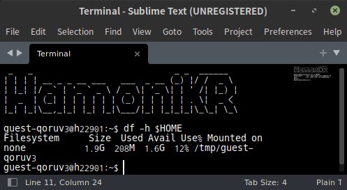
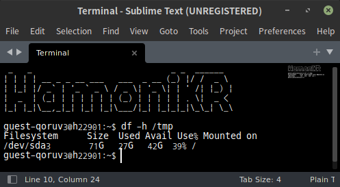

## 기간
**24.12.23 ~ 24.12.29**

---

# /tmp 폴더의 비밀



$HOME 폴더는 총 용량이 1.9GB이다.<br><br><br>



그러나 /tmp 폴더는 러스트, 서브라임, 파이어폭스를 설치하고도 용량이 무려 42GB나 남아있다.  
따라서 파일을 다운로드하거나 작업을 할 때에는 /tmp 폴더를 사용하는 것이 유리하다.  
더 상위의 폴더는 사용 권한이 없다.<br><br><br>

```sh
export RUSTUP_HOME=/tmp/rustup
export CARGO_HOME=/tmp/cargo
```

러스트는 기본적으로 $HOME/.rustup과 $HOME/.cargo에 설치되는데, 환경변수를 설정하여 특정 경로에 설치할 수 있다.<br><br><br>

---

# 다크모드

```sh
gsettings set org.cinnamon.desktop.wm.preferences theme 'Mint-Y-Dark'
gsettings set org.cinnamon.desktop.interface icon-theme 'breeze-dark'
gsettings set org.cinnamon.desktop.interface gtk-theme 'Mint-Y-Dark'
gsettings set org.cinnamon.desktop.interface cursor-theme 'DMZ-Black'
gsettings set org.cinnamon.theme name 'Mint-Y-Dark'
git clone https://토큰@github.com/wallpaper /tmp/wallpaper
gsettings set org.cinnamon.desktop.background picture-uri 'file:///tmp/wallpaper/wallpaper.jpeg'
```

민간인일 땐 매일 검은 화면만 쳐다보다가 사지방 컴퓨터를 보니까 테마든 바탕화면이든 인터넷이든 들어갈 때마다 눈이 너무 아프다.  
사지방은 시나몬 환경을 사용한다.  
배경화면은 적당한 놈을 깃허브에 기생시켜서 사용하고 있다.  
원래 imgur을 사용했는데 약관에 이렇게 쓰지 말라고 적혀있어서 깃허브로 옮겼다.  
다만 전체 레포지토리를 다운로드하는 것이 아주 미미한 오버헤드가 있을 것 같은데 릴리즈에 올린 후 curl이나 wget으로 받아야하나...?  
일회용 이메일로 깃허브 아이디를 만들었더니 봇으로 판단했는지 반쯤 차단된 계정이 되어서 토큰으로 접근해야한다.  
사족으로 바탕화면이 바뀔 때 자동으로 페이드 효과가 들어간다.  
일정 시간마다 바뀌게 월페이퍼 엔진처럼 만들면 멋질 거 같은데 귀찮다.<br><br><br>

# 서브라임 텍스트

```sh
git clone https://토큰@github.com/sublime-text $HOME/.config/sublime-text
wget -O /tmp/sublime.deb https://download.sublimetext.com/latest/stable/linux/x64/deb
dpkg -x /tmp/sublime.deb /tmp/sublime
echo 'alias sublime=/tmp/sublime/opt/sublime_text/sublime_text' >> ~/.bashrc
echo '/tmp/sublime/opt/sublime_text/sublime_text' > $HOME/Desktop/sublime.sh
```

콘솔 만들기는 반쯤 유기...  
일단 서브라임 텍스트의 TerminalView 플러그인을 사용하기로 했다.  
clear 명령이 안 먹고 (대신 ctrl + l 로 지울 수 있다), 한글이 깨지고, 터미널에서 글자 색이 적용되지 않는 문제점이 있지만 큰 문제는 아니라서 참기로 했다.  
서브라임은 vscode와 달리 플러그인을 다운받는 명령어가 없다.  
서브라임의 플러그인은 .config 폴더에 저장되므로 .config 폴더를 깃허브에 올렸다.  
덤으로 특정 파일을 열고 싶으면 바로&nbsp; `sublime foo.txt`와 같은 식으로 열 수 있게 alias를 설정했다.<br><br><br>

# alias

능률을 올리겠다는 핑계로 유용한 아리아스들을 만들어봤다.  
사실 이거 만드는게 더 시간낭비 같긴 한데  

```sh
alias lss="ls -hsFS1"
# ls인데 이제 큰것부터 정렬해줌 ls sort 느낌으로다가

alias ..="cd .."
alias ...="cd ../.."
alias ....="cd ../../.."
# 경로 바꾸기 귀찮을 때

alias md="mkdir -pv"
# 재귀적으로 폴더 만들기 가능 + 결과 출력

alias gac="git add . && git commit -m"
# add commit 동시에

alias sb="source ~/.bashrc"
# bashrc 새로고침

alias path='echo -e ${PATH//:/\\n}'
# $PATH 출력
```

이번주는 거의 뻘짓의 향연이었다.  
다음주도 잉여롭게 보내봅세
