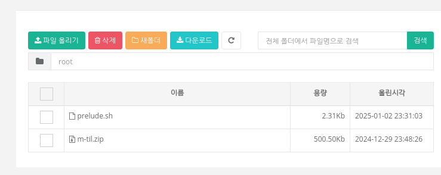

## 기간
**24.12.30 ~ 25.01.05**

---

하모니카 OS에는 KT 클라우드 저장소가 깔려있다.

여기에 파이어폭스, 러스트, 서브라임 텍스트 다운로드 스크립트와 필요한 파일들을 저장해 유용하게 사용하고 있었다.  

처음에는 이게 QT 등으로 만든 하나의 프로그램이라고 생각했는데,  

어느 순간 파일을 다운받을 때 http://webdisk.skir.kr/pages/file_download?seq=3 이라는 주소가 뜨는 것을 보고  

Electron 등을 사용한 일종의 웹앱이라 판단했다.  

특이한 점은 클라우드 페이지가 인트라넷이 아닌 인터넷 서버에 있다는 것이다.  

https가 아닌 http로 접속되는 것을 보고 국방부 특성 상 무조건 보안 취약점이 있을거라 생각해 연구를 시작했다.

---

1. 사지방 패스워드는 평문으로 저장?

사지방에서는 컴퓨터를 시작할 때 계정에 로그인하여 들어간다.  

하모니카에서 브라우저가 아닌 내장된 클라우드 저장소 앱을 실행하면  

로그인 창이 생략되고 하모니카 계정으로 로그인된다.  

그런데, 하모니카에서 생성된 계정이 아니라 윈도우에서 생성된 계정으로 사지방에 로그인하고  

하모니카 클라우드 저장소 앱을 실행하면 로그인에 실패했다는 창이 뜬다.  

어디에서 생성된 계정인지 판단하지 않고 하모니카 계정으로 자동 로그인해서 생긴 문제다.  

사지방에 로그인 시, 로그인에 사용된 아이디와 패스워드를 컴퓨터 어딘가 저장해놓고 앱 실행 시 복붙하는 로직인걸까?  

이 로직이라면 패스워드를 암호화하지 않고 평문으로 저장했거나, 암호화된 패스워드로도 로그인이 가능하게 설계되었을 것이라는 생각이 들었다.  

wireshark를 설치할 수 있었다면 진실을 쉽게 깨달아낼 수 있었을텐데...  

윈도우에서 계정을 생성하고, 하모니카에서 같은 아이디와 패스워드로 계정을 생성해서  

윈도우 계정으로 로그인 시 하모니카 계정으로 로그인된다면 취약점이 있는 것이다.  

그런데 문제는 윈도우 계정으로 로그인할지, 하모니카 계정으로 로그인할지 선택할 수 없다는 것이다.  

---

1-2. DB를 대체 어떻게 만들어놓은거야?  

1을 실험해보다가 알아낸 문제점인데, 윈도우 계정과 하모니카 계정을 동일한 아이디와 패스워드로 설정할 수 있다...  

동일한 아이디와 패스워드일 경우, 하모니카 계정으로 우선 로그인 되었다.

하모니카 DB로 로그인을 시도한 후, 실패 시 윈도우 DB에서 로그인을 시도하는 걸까?

---

1-3. 심증은 있는데...

사지방 로그인 - 패스워드 변경 - 클라우드 앱 실행  

예상대로 패스워드 변경 시 로그인에 실패했다.  

사지방 로그인 시에 1번, 어딘가에 아이디와 패스워드를 저장한다는 것은 확실해졌다.

---

1-4. 

윈도우 계정과 하모니카 계정의 패스워드를 다르게 설정한다.

윈도우 컴퓨터에서 하모니카 계정으로 로그인한다.  

하모니카 컴퓨터에서 윈도우 계정으로 로그인한다.

윈도우 컴퓨터에서 하모니카 계정 패스워드를 윈도우 계정 패스워드와 동일하게 바꾼다.  

하모니카 컴퓨터에서 클라우드 앱을 실행한다.  

클라우드 앱에서 하모니카 계정으로 로그인되면 취약점이 있다는 것이다.  

그런데 윈도우에서 하모니카 패스워드가 안 바꿔져서 실패했다.  

---

1-5.

윈도우 계정을 만든다.  

하모니카 컴퓨터에서 윈도우 계정으로 로그인한다.  

이 상태에서 클라우드 앱을 실행하면 로그인 에러가 난다.  

하모니카 컴퓨터에서 하모니카 계정을 윈도우 계정과 아이디와 패스워드가 동일하게 생성한다.  

이 상태에서 클라우드 앱 실행 시 로그인이 된다면 취약점이 있다는 것이다.

윈도우 계정은 하나밖에 못 만들고, 하모니카 계정을 이미 윈도우 계정의 아이디와 같게 만들어서 나는 불가능.  

다른 사람에게 부탁해서 언젠가는 이 가설을 증명해봐야겠다.

---

2. 세션 취약점  

PHPSESSID = "ae3g01e6asd123e123912312139asd12324a" 와 같은 방식으로 세션에 해당하는 토큰을 쿠키로 저장하고 있다.  

로그아웃할 때는 세션이 파괴되지만, 단순히 브라우저를 종료하는 것만으로는 세션이 파괴되지 않는다.  

단순히 세션이 파괴되지 않는 것이 취약점은 아니지만, 세션에 만료 기간이 존재하는 지 의문이다.

2-1. 1계정 多세션

취약점은 아니지만, 시크릿 탭 등을 사용해서, 계정 로그인을 반복하면 1계정으로 여러 세션을 실행할 수 있다.  

2-2. 유저가 토큰 아이디를 결정?  

관리자 콘솔이나 자바스크립트을 이용해서, PHPSESSID = "1" 등으로 설정한 후 로그인하면 적용된다.  

유저가 세션에 해당하는 토큰 키를 수정할 수 있는 게 취약점인지는 모르겠다.  

GPT 선생님한테 물어봤더니

> 쿠키에 저장된 세션 ID를 사용자가 수정할 수 있다면, 이는 보안 취약점으로 간주될 수 있습니다. 세션 ID는 사용자의 로그인 상태를 관리하는 중요한 정보이므로, 이를 안전하게 보호해야 합니다. 사용자가 세션 ID를 임의로 수정할 수 있다면, 다른 사용자나 공격자가 해당 세션 ID를 사용해 다른 사용자의 세션에 접근할 수 있는 잠재적인 위험이 존재합니다.
> 이와 같은 취약점은 "세션 하이재킹" 또는 "세션 고정 공격(Session Fixation)" 등으로 알려져 있으며, 이를 방지하기 위한 몇 가지 방법이 있습니다:
> 1. **세션 ID 보호**: 세션 ID는 암호화된 쿠키에 저장하고, HttpOnly 및 Secure 속성을 설정하여 클라이언트 측에서 세션 ID를 수정하거나 탈취할 수 없도록 해야 합니다.
> 2. **세션 ID 회전**: 사용자가 로그인할 때마다 새로운 세션 ID를 발급하여, 기존의 세션 ID를 사용하지 않도록 합니다. 이 방식은 세션 하이재킹을 방지하는 데 유효합니다.
> 3. **세션 ID의 유효성 검사**: 세션 ID가 서버 측에서 발급한 값인지, 그리고 그것이 올바른 세션인지 확인하는 추가적인 검사를 도입해야 합니다.
> 따라서 사용자가 세션 ID를 수정할 수 있다는 것은 보안 취약점이 될 수 있으며, 이를 해결하기 위해서는 위와 같은 보안 강화를 고려해야 합니다.

라고 한다.  

2-3. 관리자 계정?

세션 가지고 장난질을 좀 하면 관리자 계정인지 테스트 계정인지 오류처리용 계정인지는 모르겠는데 어떤 계정으로 로그인된다.

---

이 모든 글은 고양이가 작성했음을 밝힙니다.
