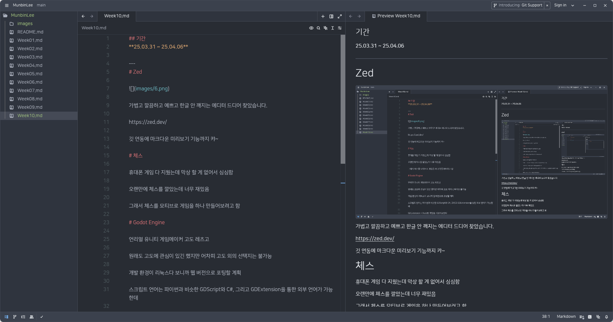

## 기간
**25.03.31 ~ 25.04.06**

---
# Zed

가볍고 깔끔하고 예쁘고 한글 안 깨지는 에디터 드디어 찾았습니다.

https://zed.dev/

깃 연동에 마크다운 미리보기 기능까지 캬~

# 체스

휴대폰 게임 다 지웠는데 막상 할 게 없어서 심심함

오랜만에 체스를 깔았는데 너무 재밌음

그래서 체스를 모티브로 게임을 하나 만들어보려고 함

# Godot Engine

언리얼 유니티 게임메이커 고도 레츠고

원래도 고도에 관심이 있긴 했지만 어차피 고도 외의 선택지는 불가능

개발 환경이 리눅스다 보니까 웹 버전으로 포팅할 계획

스크립트 언어는 파이썬과 비슷한 GDScript와 C#, 그리고 GDExtension을 통한 외부 언어가 가능한데

C#은 웹 포팅을 지원하지 않음

그래서 GDExtension + Rust로 개발을 시도해 봄

근데 컴퓨터가 너무 느려서 Rust로 컴파일하면 에러 뜸

https://github.com/rust-lang/rustc_codegen_cranelift 를 설치했더니 정상적으로 컴파일됨

근데 웹 포팅 과정에서 wasm을 컴파일할 때 에러 발생

그냥 GDScript로 해봐야겠음
